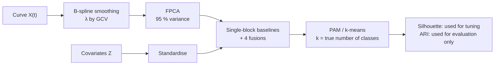

# functional-data-clustering

When every observation is a **curve plus a vector of covariates**, how should the two be fused
to find clusters, and can the fusion be tuned without labels? Four fusion strategies against
single-block baselines, on three public datasets and 200 simulated runs: tuning the fusion by
silhouette costs about as much accuracy as the choice of geometry itself, so the tuning
criterion deserves as much attention as the distance.

[](https://github.com/Pchambet/functional-data-clustering/actions/workflows/ci.yml)

[](docs/rapport_stage.pdf)

*Version française : [README.fr.md](README.fr.md).*


## TL;DR

- **Silhouette tuning is the bottleneck.** Choosing the curve/covariate weights (α, ω) of a
  weighted distance by silhouette lands on a single-modality corner on all three real datasets
  and scores far below the best point of the same grid (an oracle that needs the labels):
  ARI 0.616 vs 0.898 (Canadian Weather), 0.424 vs 0.756 (Berkeley Growth),
  0.151 vs 0.626 (Tecator). On Tecator the best grid point is itself a single-block corner:
  the derivative distance alone.
- **No fusion geometry wins everywhere.** Among the methods that need no labels to run, the
  highest ARI comes from the simplest fusion, FPCA scores + covariates with k-means, on Canadian
  Weather (0.748) and Berkeley Growth (0.682). On Tecator it comes from no fusion at all: the
  derivative distance $D_1$ (0.626).
- **Simulation tells the same story** (4 scenarios × 50 seeds, n = 300, k = 3). A product of
  Gaussian kernels has the best overall mean ARI (0.651) and wins while the curves separate the
  classes (0.938 and 0.887 in S1–S2); when the curve signal is halved, FPCA + k-means wins S3
  (0.623) and the derivative distance alone wins S4 (0.378).
- **The hybrid PCA (HFV) does not beat the plain kernel product.** Reconstructing curves from a
  joint curve/covariate covariance before the kernel step is behind the kernel product in 62 % to
  78 % of paired runs per scenario (mean ARI gap 0.016 to 0.085), and matches it within 0.003
  on real data.
- **Bootstrap instability does not recover k.** `fpc::nselectboot` finds the true number of
  classes at 1 / 441 grid points on Canadian Weather and 4 / 441 on Tecator.
- **Its default answer is k = 2** (223 / 441 grid points on Canadian Weather, 382 / 441 on
  Tecator). On Berkeley Growth, where the true k is 2, it is therefore right by default
  (276 / 441).

## Why it matters

Mixed functional + vector data is common in operations: a sensor trace plus the asset's
attributes, a load curve plus a customer profile, a flight's speed profile plus its aircraft
and route. Segmenting such units is unsupervised by nature, so every fusion weight and every
k has to be chosen by an internal criterion. This project measures how much that choice costs:
on the same grid, silhouette-based tuning gives up 0.283 to 0.475 ARI against the best weights,
about as much as the spread between geometries (0.229 to 0.748 on Canadian Weather). The
criterion deserves as much attention as the distance.

## Approach



1. **Data.** Three labelled public datasets shipped with CRAN packages (Canadian Weather,
   Berkeley Growth, Tecator, see [docs/biblio](docs/biblio/README.md)) and a simulator with three
   knobs: level separation and derivative separation of the curves, and mean separation of the
   covariates (`src/simulate_cas2_deriv.R`).
2. **Geometries.** Baselines on one block (curve level $D_0$, curve derivative $D_1$, covariates
   $D_s$) and four fusions:
   **A** FPCA scores concatenated with Z, then k-means;
   **B** weighted distance
   $D_w(\alpha,\omega)=\sqrt{\omega D_p(\alpha)^2+(1-\omega)\tilde D_s^2}$ with the curve part
   $D_p(\alpha)=\sqrt{(1-\alpha)\tilde D_0^2+\alpha\tilde D_1^2}$ (tilde: divided by its maximum), then PAM;
   **C** product of Gaussian kernels on $D_p(\alpha)$ (curves) and $D_s$ (covariates),
   median-heuristic bandwidths, α chosen by silhouette over 21 values, then
   $D_K=\sqrt{K_{ii}+K_{jj}-2K_{ij}}$ and PAM;
   **HFV** hybrid PCA on the joint covariance of curve scores and covariates (including the
   cross-covariance block $V_{yx}$), curves reconstructed, then $D_K$.
3. **Protocol.** Hyperparameters are chosen by mean silhouette: (α, ω) on a 21 × 21 grid for B,
   α over 21 values for C (HFV has none); the
   labels are used **only** to score the final partition with the Adjusted Rand Index. The
   "best on grid" points in the hero figure are an oracle that needs the labels: the maximum ARI
   over 441 configurations, which is an optimistic upper bound (on 35 stations, part of that
   maximum is selection on noise).
4. **Choosing k.** Separately, bootstrap instability (Fang & Wang, 2012) is mapped over the
   same (α, ω) grid with B = 150 resamples and k ∈ {2, …, 6} (simulated data: a coarser
   6 × 6 grid with B = 60).

## Results

**Real data** — ARI against the true labels (silhouette in brackets), k fixed to the number of
classes. Best ARI per dataset in bold. The pipeline exports the derivative baseline $D_1$ only
in simulation; on real data $D_1$ is the (α = 1, ω = 1) corner of B's grid ($D_w(1,1)=D_1/\max D_1$,
and PAM, silhouette and ARI ignore that scale factor). The committed grid table records that
corner only on Tecator, where it is the best grid point.

| Method | Canadian Weather (n = 35, k = 4) | Berkeley Growth (n = 93, k = 2) | Tecator (n = 215, k = 3) |
|---|---|---|---|
| Curves only, level $D_0$ | 0.229 (0.285) | 0.115 (0.402) | 0.151 (0.509) |
| Curves only, derivative $D_1$ | not exported | not exported | **0.626** (0.248) |
| Covariates only, $D_s$ | 0.616 (0.448) | 0.424 (0.554) | 0.546 (0.476) |
| A · FPCA + Z, k-means | **0.748** (0.395) | **0.682** (0.360) | 0.439 (0.403) |
| B · $D_w$, silhouette-tuned | 0.616 (0.448) | 0.424 (0.554) | 0.151 (0.509) |
| C · kernel product $D_K$ | 0.686 (0.329) | 0.368 (0.261) | 0.371 (0.265) |
| HFV + $D_K$ | 0.686 (0.332) | 0.368 (0.273) | 0.374 (0.284) |

Takeaway: within B's grid, the silhouette-chosen point is a single-block corner on every
dataset (covariates on Canadian Weather and Growth, curve level on Tecator) and lands 0.283 to
0.475 ARI below the best point (hero figure). Across rows the highest silhouette never has the
highest ARI either, although silhouettes from different spaces are not directly comparable
(see limitations). On Tecator no fusion beats the derivative distance alone.

**Simulation** — mean ARI over 50 seeds with 95 % confidence intervals.


Takeaway: the ranking depends on where the signal lives. Silhouette-tuned B (amber) picks the
derivative corner (α = 1, ω = 1) in every S1–S2 run, where it equals $D_1$ exactly (0.873), and
the curve-level corner (α = 0, ω = 1) in 80 % of S3–S4 runs, which fails once the covariates
carry the signal (0.239 in S3).

**Choosing k without labels** — share of the (α, ω) grid where `nselectboot` selects the true k.

| Data | True k | Grid | True k selected |
|---|---|---|---|
| Canadian Weather | 4 | 21 × 21, B = 150 | 1 / 441 |
| Berkeley Growth | 2 | 21 × 21, B = 150 | 276 / 441 |
| Tecator | 3 | 21 × 21, B = 150 | 4 / 441 |
| Simulated S1 / S2 / S3 / S4 (seed 1) | 3 | 6 × 6, B = 60 (fast mode) | 33 / 26 / 3 / 0 of 36 |

Takeaway: on real data instability mostly picks k = 2 (the median answer on all three datasets),
with the largest k tried (6) second on Canadian Weather and Growth; it finds the true k = 3 only
when the simulated curves carry a strong signal (S1, S2).

The numbers above are read from the committed result files and recorded in
[`docs/figures/summary.json`](docs/figures/summary.json). `make check` fails if `summary.json` is
stale, if this README drops or changes a table cell, headline value, share or count derived from
it, or if [README.fr.md](README.fr.md) drops a headline value.

## Reproduce

Requires R 4.x and the CRAN packages `fda`, `fda.usc`, `cluster`, `mclust`, `fpc`. The data
ship with those packages, so there is nothing to download.

```bash
make setup      # install / check packages, write docs/session_info.txt
make pipeline   # three real datasets: figures/<dataset>/ and docs/exports/*.csv
make exp03      # simulated benchmark, 4 scenarios x 50 seeds (long)
make exp01      # bootstrap instability on the real datasets, 21 x 21 grid x B = 150 (long)
make exp01-sim  # same on simulated S1-S4, seed 1, fast mode: 6 x 6 grid x B = 60
make tables     # regenerate docs/generated/*.tex from the result CSVs
make report     # compile the project report and the stability report (LaTeX, latexmk)
make slides     # compile the defence slides (needs the LaTeX beamer class)
```

`make exp01-sim` reproduces the committed simulated rows of the instability table (the script
estimates 15 to 25 minutes). The full
simulated design (21 × 21, B = 150, several hours) is
`Rscript experiments/01_instabilite/run_simulated_instabilite_only.R --full`; it overwrites
`experiments/01_instabilite/results_simulated/` with a different design.

The README figures and numbers are rebuilt from the committed CSVs without R
(Python 3.12 via [uv](https://docs.astral.sh/uv/), a few seconds):

```bash
make figures    # docs/figures/*.png + summary.json
make check      # summary.json, README numbers and links are consistent
```

## Repository layout

```text
src/                      R pipeline (main.R runs one dataset end to end)
  00_preprocess*.R        dataset loaders (Canadian Weather, Growth, Tecator, simulated)
  simulate_cas2_deriv.R   simulator of labelled curve + covariate data
  01_lissage.R            B-spline smoothing, roughness penalty chosen by GCV
  02_fpca.R               functional PCA
  02b_pca_hybride_reconstruction.R   hybrid (HFV) PCA on the joint covariance
  03_distances.R          D0, D1, Ds, Dp(α), Dw(α, ω), kernel distance DK
  03b_distances_noyaux_hybrides.R    DK on HFV-reconstructed curves
  04_clustering.R         grid search, PAM / k-means, silhouette and ARI
  05_visualisation.R      per-dataset figures
experiments/
  01_instabilite/         nselectboot over the (α, ω) grid, real and simulated data
  03_simulated_hybride/   simulated benchmark: protocol, results (CSV), detailed report
scripts/                  LaTeX table generators (R) and README figures (Python)
docs/                     project report (rapport_stage.tex/.pdf), slides, generated tables, references
figures/<dataset>/        figures written by the pipeline (French labels; fig05 maps
                          silhouette and ARI over B's (α, ω) grid)
```

## Methodology notes and limitations

- **k is given.** All method comparisons fix k to the true number of classes; the only
  experiment that selects k (instability) shows it is not reliable here. Real-world use would
  face both problems at once.
- **Small real datasets.** Canadian Weather has 35 stations, so a single misassigned station
  moves the ARI noticeably. The real-data table is one deterministic run per method, without
  resampling intervals.
- **On all three real datasets the covariates are tied to the label or to the curve.** On
  Canadian Weather the label is a geographic climate region and two of the three covariates
  are the station's latitude and longitude, so the covariates alone carry much of the label
  (ARI 0.616 for $D_s$). On Tecator the label is a binned fat content and the covariates are
  water and protein, which are chemically tied to fat; this explains why the covariates alone
  win. On Berkeley Growth both covariates (final height, total growth) are computed from the
  curve itself.
- **Silhouettes from different distances are not on a common scale.** The silhouette of each
  method is computed in its own space ($D_0$, $D_s$, $D_w$, $D_K$, the k-means feature space
  of A), so comparing them across methods, or across corners of B's grid, is not comparing like
  with like. This is one mechanism behind the paradox: single-block corners can simply have a
  more favourable silhouette scale.
- **Simulation is one generative model.** Conclusions on S1–S4 are conditional on the Fourier
  basis and the effect sizes of `Cas2_deriv`. The simulated `nselectboot` run uses a reduced
  6 × 6 grid, B = 60 and a single seed.
- **Kernel bandwidths** use the median heuristic and are not tuned; a different choice could
  change the ranking of C and HFV.
- **Reproducibility.** Package versions are not pinned (no `renv.lock`), and the R and package
  versions behind the committed results were not recorded. `make setup` writes `sessionInfo()`
  to `docs/session_info.txt`, which is meant to be committed with the next run. The report,
  the slides and code comments are in French.

## References

- Ramsay & Silverman (2005), *Functional Data Analysis*, Springer.
- Jang (2021), Principal component analysis of hybrid functional and vector data,
  *Statistics in Medicine*.
- Ferreira & de Carvalho (2014), kernel-based clustering with automatic variable weighting,
  *Pattern Recognition*.
- Rousseeuw (1987), silhouettes; Hubert & Arabie (1985), Adjusted Rand Index.
- Fang & Wang (2012), selection of the number of clusters via the bootstrap method,
  *Computational Statistics & Data Analysis*.

Full list with DOIs and dataset sources: [docs/biblio/README.md](docs/biblio/README.md).

## Context

M2 TRIED research project ("projet long"), CNAM, CEDRIC lab (MSDMA team), 2026. Subject
proposed and supervised by V. Audigier, F. Bouhadjera and N. Niang. The full write-up is the
18-page project report in [`docs/rapport_stage.pdf`](docs/rapport_stage.pdf) (French).
The report (March 2026) predates this re-analysis; where they differ (HFV, instability,
simulated `nselectboot` settings), the README numbers are the ones checked against the result
files. The stability report
[`experiments/01_instabilite/rapport_instabilite.pdf`](experiments/01_instabilite/rapport_instabilite.pdf)
was revised to match them.

---

Built by [Pierre Chambet](https://github.com/Pchambet) — decision science for operations under uncertainty.
