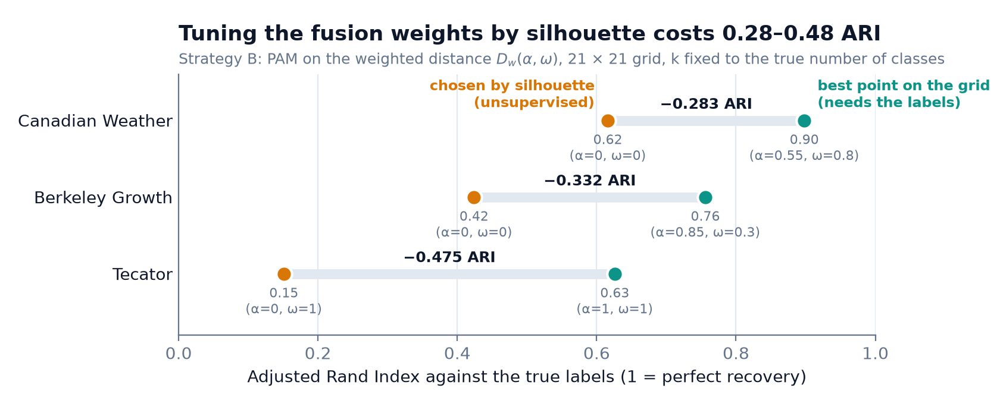
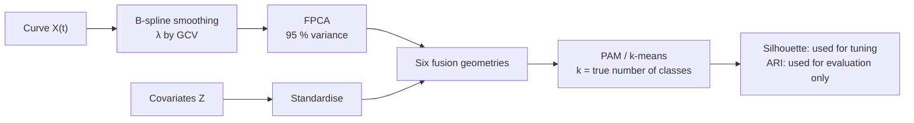
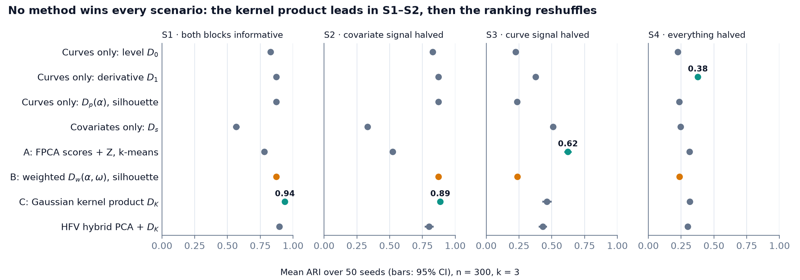

# functional-data-clustering

When every observation is a **curve plus a vector of covariates**, how should the two be fused
to find clusters — and can the fusion be tuned without labels? Four fusion strategies against
single-block baselines, on three public datasets and 200 simulated runs, with an honest answer:
the geometry matters less than the tuning criterion, and silhouette is the wrong one.

[](https://github.com/Pchambet/functional-data-clustering/actions/workflows/ci.yml)

[](LICENSE)
[](docs/rapport_stage.pdf)

*Version française : [README.fr.md](README.fr.md).*



## TL;DR

- **Silhouette tuning is the bottleneck.** Choosing the curve/covariate weights (α, ω) of a
  weighted distance by silhouette lands on a single-modality corner on all three real datasets
  and recovers far less of the true structure than the same grid allows:
  ARI 0.616 vs 0.898 (Canadian Weather), 0.424 vs 0.756 (Berkeley Growth),
  0.151 vs 0.626 (Tecator).
- **No fusion geometry wins everywhere.** On real data the best ARI comes from the simplest
  fusion, FPCA scores + covariates with k-means (0.748 Canadian Weather, 0.682 Berkeley Growth),
  or from the covariates alone (0.546 Tecator).
- **Simulation tells the same story** (4 scenarios × 50 seeds, n = 300, k = 3). A product of
  Gaussian kernels has the best overall mean ARI (0.651) and wins while the curves separate the
  classes (0.938 and 0.887 in S1–S2); when the curve signal is halved, FPCA + k-means wins S3
  (0.623) and the derivative distance alone wins S4 (0.378).
- **The hybrid PCA (HFV) does not beat the plain kernel product.** Reconstructing curves from a
  joint curve/covariate covariance before the kernel step is behind the kernel product in 62 % to
  78 % of paired runs per scenario (mean ARI gap 0.016 to 0.085), and matches it within 0.003
  on real data.
- **Bootstrap instability does not rescue k either.** `fpc::nselectboot` returns the true number
  of classes in 1 of 441 grid points on Canadian Weather and 4 of 441 on Tecator
  (276 of 441 on Berkeley Growth, where k = 2).

## Why it matters

Mixed functional + vector data is common in operations: a sensor trace plus the asset's
attributes, a load curve plus a customer profile, a flight's speed profile plus its aircraft
and route. Segmenting such units is unsupervised by nature, so every fusion weight and every
k has to be chosen by an internal criterion. This project measures how much that choice costs
— and shows that a sophisticated geometry cannot make up for a criterion that prefers compact
blobs over the real structure.

## Approach



1. **Data.** Three labelled public datasets shipped with CRAN packages (Canadian Weather,
   Berkeley Growth, Tecator, see [docs/biblio](docs/biblio/README.md)) and a simulator with three
   knobs: level separation and derivative separation of the curves, and mean separation of the
   covariates (`src/simulate_cas2_deriv.R`).
2. **Geometries.** Baselines on one block (curve level $D_0$, curve derivative $D_1$, covariates
   $D_s$) and four fusions:
   **A** FPCA scores concatenated with Z, then k-means;
   **B** weighted distance
   $D_w(\alpha,\omega)=\sqrt{\omega[(1-\alpha)\tilde D_0^2+\alpha\tilde D_1^2]+(1-\omega)\tilde D_s^2}$, then PAM;
   **C** product of Gaussian kernels $K_f K_s$ (median-heuristic bandwidths), turned into
   $D_K=\sqrt{K_{ii}+K_{jj}-2K_{ij}}$, then PAM;
   **HFV** hybrid PCA on the joint covariance of curve scores and covariates (including the
   cross-covariance block $V_{yx}$), curves reconstructed, then $D_K$.
3. **Protocol.** Hyperparameters (α, ω) are chosen by mean silhouette on a 21 × 21 grid; the
   labels are used **only** to score the final partition with the Adjusted Rand Index. The
   "best on grid" points in the hero figure are a counterfactual that needs the labels.
4. **Choosing k.** Separately, bootstrap instability (Fang & Wang, 2012) is mapped over the
   same (α, ω) grid with B = 150 resamples and k ∈ {2, …, 6}.

## Results

**Real data** — ARI against the true labels (silhouette in brackets), k fixed to the number of
classes. Best ARI per dataset in bold.

| Method | Canadian Weather (n = 35, k = 4) | Berkeley Growth (n = 93, k = 2) | Tecator (n = 215, k = 3) |
|---|---|---|---|
| Curves only, $D_0$ | 0.229 (0.285) | 0.115 (0.402) | 0.151 (0.509) |
| Covariates only, $D_s$ | 0.616 (0.448) | 0.424 (0.554) | **0.546** (0.476) |
| A · FPCA + Z, k-means | **0.748** (0.395) | **0.682** (0.360) | 0.439 (0.403) |
| B · $D_w$, silhouette-tuned | 0.616 (0.448) | 0.424 (0.554) | 0.151 (0.509) |
| C · kernel product $D_K$ | 0.686 (0.329) | 0.368 (0.261) | 0.371 (0.265) |
| HFV + $D_K$ | 0.686 (0.332) | 0.368 (0.273) | 0.374 (0.284) |

Takeaway: the highest silhouette in each column never belongs to the highest ARI, and the
silhouette-tuned B collapses to a single block (covariates on Canadian Weather and Growth,
curve level on Tecator).

**Simulation** — mean ARI over 50 seeds with 95 % confidence intervals.



Takeaway: the ranking depends on where the signal lives. Silhouette-tuned B (amber) collapses
to a pure curve-distance corner (ω = 1, α ∈ {0, 1}) in every S1–S2 run and in 80 % of S3–S4
runs, which is right in S1–S2 (0.873) and wrong once the covariates carry the signal (0.239 in S3).

**The paradox on one dataset** — silhouette (left) and ARI (right) over the (α, ω) grid on
Canadian Weather. The silhouette peaks at the covariates-only corner (×); the ARI plateau is
in the mixed region.


**Choosing k without labels** — share of the (α, ω) grid where `nselectboot` selects the true k.

| Data | True k | Grid | True k selected |
|---|---|---|---|
| Canadian Weather | 4 | 21 × 21, B = 150 | 1 / 441 |
| Berkeley Growth | 2 | 21 × 21, B = 150 | 276 / 441 |
| Tecator | 3 | 21 × 21, B = 150 | 4 / 441 |
| Simulated S1 / S2 / S3 / S4 (seed 1) | 3 | 6 × 6, fast mode | 33 / 26 / 3 / 0 of 36 |

Takeaway: on real data instability mostly picks k = 2 or the largest k tried (6); it finds the
true k = 3 only when the simulated curves carry a strong signal.

All numbers above are read from the committed result files and recorded in
[`docs/figures/summary.json`](docs/figures/summary.json); `make check` fails if the README drifts
from them.

## Reproduce

Requires R 4.x and the CRAN packages `fda`, `fda.usc`, `cluster`, `mclust`, `fpc`. The data
ship with those packages, so there is nothing to download.

```bash
make setup      # install / check packages, write docs/session_info.txt
make pipeline   # three real datasets: figures/<dataset>/ and docs/exports/*.csv
make exp03      # simulated benchmark, 4 scenarios x 50 seeds (long)
make exp01      # bootstrap instability, 21 x 21 grid x B = 150 (long)
make tables     # regenerate docs/generated/*.tex from the result CSVs
make report     # compile the thesis and the stability report (LaTeX, latexmk)
```

The README figures and numbers are rebuilt from the committed CSVs without R
(Python 3.12 via [uv](https://docs.astral.sh/uv/), a few seconds):

```bash
make figures    # docs/figures/*.png + summary.json
make check      # summary.json, README numbers and links are consistent
```

## Repository layout

```text
src/                      R pipeline (main.R runs one dataset end to end)
  00_preprocess*.R        dataset loaders (Canadian Weather, Growth, Tecator, simulated)
  simulate_cas2_deriv.R   simulator of labelled curve + covariate data
  01_lissage.R            B-spline smoothing, roughness penalty chosen by GCV
  02_fpca.R               functional PCA
  02b_pca_hybride_reconstruction.R   hybrid (HFV) PCA on the joint covariance
  03_distances.R          D0, D1, Ds, Dp(α), Dw(α, ω), kernel distance DK
  03b_distances_noyaux_hybrides.R    DK on HFV-reconstructed curves
  04_clustering.R         grid search, PAM / k-means, silhouette and ARI
  05_visualisation.R      per-dataset figures
experiments/
  01_instabilite/         nselectboot over the (α, ω) grid, real and simulated data
  03_simulated_hybride/   simulated benchmark: protocol, results (CSV), detailed report
scripts/                  LaTeX table generators (R) and README figures (Python)
docs/                     thesis (rapport_stage.tex/.pdf), slides, generated tables, references
figures/<dataset>/        figures written by the pipeline
```

## Methodology notes and limitations

- **k is given.** All method comparisons fix k to the true number of classes; the only
  experiment that selects k (instability) shows it is not reliable here. Real-world use would
  face both problems at once.
- **Small real datasets.** Canadian Weather has 35 stations, so a single misassigned station
  moves the ARI noticeably. The real-data table is one deterministic run per method, without
  resampling intervals.
- **Covariates are not always independent of the label or of the curve.** On Tecator the
  label is a binned fat content and the covariates are water and protein, which are
  chemically tied to fat; this explains why the covariates alone win. On Berkeley Growth both
  covariates (final height, total growth) are computed from the curve itself.
- **Simulation is one generative model.** Conclusions on S1–S4 are conditional on the Fourier
  basis and the effect sizes of `Cas2_deriv`. The simulated `nselectboot` run uses a reduced
  6 × 6 grid and a single seed.
- **Kernel bandwidths** use the median heuristic and are not tuned; a different choice could
  change the ranking of C and HFV.
- **Reproducibility.** Package versions are not pinned (no `renv.lock`); `make setup` records
  `sessionInfo()` in `docs/session_info.txt`. The thesis, the slides and code comments are in
  French; the slides need the LaTeX `beamer` class.

## References

- Ramsay & Silverman (2005), *Functional Data Analysis*, Springer.
- Jang (2021), Principal component analysis of hybrid functional and vector data,
  *Statistics in Medicine*.
- Ferreira & de Carvalho (2014), kernel-based clustering with automatic variable weighting,
  *Pattern Recognition*.
- Rousseeuw (1987), silhouettes; Hubert & Arabie (1985), Adjusted Rand Index.
- Fang & Wang (2012), selection of the number of clusters via the bootstrap method,
  *Computational Statistics & Data Analysis*.

Full list with DOIs and dataset sources: [docs/biblio/README.md](docs/biblio/README.md).

## Context

M2 TRIED research project ("projet long"), CNAM, CEDRIC lab (MSDMA team), 2026. Subject
proposed and supervised by V. Audigier, F. Bouhadjera and N. Niang. The full write-up is the
thesis in [`docs/rapport_stage.pdf`](docs/rapport_stage.pdf) (French).

---

Built by [Pierre Chambet](https://github.com/Pchambet) — decision science for operations under uncertainty.
